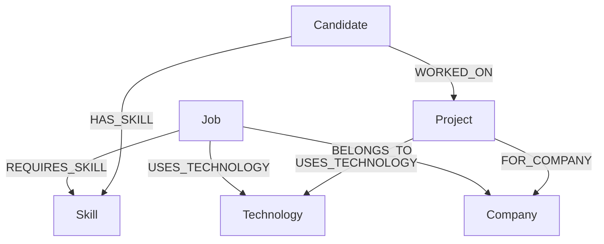

# TalentGraph

> **Graph-Powered Candidate Discovery** — A recruiter-focused application using CognoDB (graph database) to discover candidates through relationship traversal, not just keyword matching.

---

## Project Overview

TalentGraph is a graph database take-home assignment built for WEXA AI. It demonstrates how a property graph database can model the relationships between candidates, skills, projects, technologies, and companies to enable intelligent multi-hop candidate matching.

A recruiter can select a job, click **Find Candidates**, and instantly see ranked candidates with explanations derived from real graph traversal paths — not hardcoded logic.

---

## Why a Graph Database?

Traditional relational systems express candidate matching through complex multi-table JOINs:

```sql
SELECT c.* FROM candidates c
JOIN candidate_projects cp ON c.id = cp.candidate_id
JOIN projects p ON cp.project_id = p.id
JOIN project_technologies pt ON p.id = pt.project_id
JOIN technologies t ON pt.technology_id = t.id
JOIN job_technologies jt ON t.id = jt.technology_id
WHERE jt.job_id = $jobId
```

In CognoDB (openCypher), the same multi-hop traversal is expressed naturally:

```cypher
MATCH (c:Candidate)-[:WORKED_ON]->(p:Project)-[:USES_TECHNOLOGY]->(t:Technology)<-[:USES_TECHNOLOGY]-(j:Job {id: $jobId})
RETURN c, p, t
```

The graph model makes relationship-traversal queries readable, efficient, and easy to explain. This is the core value TalentGraph demonstrates.

---

## Features

- **Job Selection** — Browse and select from seeded job roles
- **Direct Skill Matching** — Find candidates with required skills
- **Multi-hop Traversal** — Discover candidates via project → technology → job paths
- **Explainable Matching** — Natural language explanations generated from real graph paths
- **Deterministic Match Scoring** — Formula-based scoring (documented below)
- **Candidate Details** — Full profile with graph path visualization
- **Loading / Empty / Error States** — All async operations handled gracefully
- **Responsive Design** — Works on desktop, tablet, and mobile

---

## Architecture

```
React + TypeScript + Vite
        ↓ HTTP (REST)
Node.js + Express + TypeScript
        ↓ Neo4j JavaScript Driver (Bolt)
CognoDB Cloud (openCypher Graph Database)
```

The frontend **never** connects to CognoDB directly. All database operations go through the Express backend.

---

## Graph Data Model



### Nodes

| Node | Key Properties |
|------|---------------|
| `Candidate` | id, name, headline, location, yearsExperience, bio |
| `Skill` | id, name, category |
| `Job` | id, title, description, location, employmentType |
| `Project` | id, name, description, domain |
| `Technology` | id, name, category |
| `Company` | id, name, industry, location |

### Relationships

| Relationship | From → To |
|---|---|
| `HAS_SKILL` | Candidate → Skill |
| `WORKED_ON` | Candidate → Project |
| `USES_TECHNOLOGY` | Project → Technology |
| `FOR_COMPANY` | Project → Company |
| `REQUIRES_SKILL` | Job → Skill |
| `USES_TECHNOLOGY` | Job → Technology |
| `BELONGS_TO` | Job → Company |

---

## Key Cypher Queries

### 1. List Jobs

```cypher
MATCH (j:Job)-[:BELONGS_TO]->(c:Company)
OPTIONAL MATCH (j)-[:REQUIRES_SKILL]->(s:Skill)
OPTIONAL MATCH (j)-[:USES_TECHNOLOGY]->(t:Technology)
RETURN j, c, collect(DISTINCT s.name) AS requiredSkills, collect(DISTINCT t.name) AS technologies
ORDER BY j.title
```

### 2. Direct Candidate Matching

Find candidates who have skills directly required by a job:

```cypher
MATCH (j:Job {id: $jobId})-[:REQUIRES_SKILL]->(s:Skill)<-[:HAS_SKILL]-(c:Candidate)
WITH c, collect(DISTINCT s.name) AS matchingSkills, count(DISTINCT s) AS matchCount
RETURN c, matchingSkills, matchCount
ORDER BY matchCount DESC
```

### 3. Multi-Hop Traversal (The Graph Advantage)

This is the **relationally awkward query** — it traverses 4 hops to find candidates whose _project experience_ connects them to a job's required technologies:

```cypher
MATCH (j:Job {id: $jobId})-[:USES_TECHNOLOGY]->(t:Technology)
MATCH (c:Candidate)-[:WORKED_ON]->(p:Project)-[:USES_TECHNOLOGY]->(t)
WITH c, p, collect(DISTINCT t.name) AS matchingTechs, count(DISTINCT t) AS techMatchCount
RETURN c, matchingTechs, techMatchCount
ORDER BY techMatchCount DESC
```

**Path:** `Candidate → WORKED_ON → Project → USES_TECHNOLOGY → Technology ← USES_TECHNOLOGY ← Job`

This would require 5+ JOINs in a relational database and is unnatural to express and optimize. In a graph, it is a single readable traversal.

### 4. Match Explanation Query

Returns the specific paths between a candidate and a job for generating natural language explanations:

```cypher
MATCH (c:Candidate {id: $candidateId})
MATCH (j:Job {id: $jobId})
OPTIONAL MATCH (j)-[:REQUIRES_SKILL]->(s:Skill)<-[:HAS_SKILL]-(c)
OPTIONAL MATCH (j)-[:USES_TECHNOLOGY]->(t:Technology)<-[:USES_TECHNOLOGY]-(p:Project)<-[:WORKED_ON]-(c)
RETURN c, j, collect(DISTINCT s) AS directSkillMatches,
       collect(DISTINCT {project: p.name, technology: t.name}) AS projectPaths
```

---

## Match Score Formula

Scores are **deterministic** (not random), based on actual graph match data:

```
Score = min(skillMatchCount × 15, 60)
      + min(techMatchCount × 8, 40)
      capped at 100
```

| Match Type | Points per Match | Cap |
|---|---|---|
| Required skill directly matched | 15 | 60 |
| Technology matched via project path | 8 | 40 |

---

## Seed Data

The seed script creates realistic, interconnected graph data:

- **12 candidates** (diverse roles, locations, experience levels)
- **10 skills** (Node.js, TypeScript, Python, React, PostgreSQL, Docker, AWS, GraphQL, Kubernetes, Go)
- **10 technologies** (Node.js, PostgreSQL, Redis, Docker, AWS, Kafka, Elasticsearch, React, Kubernetes, GraphQL)
- **6 companies** (FinTech Solutions, HealthBridge, ShopStream, LogiCore, LearnSphere, CloudBase)
- **6 jobs** (Senior Backend Engineer, Full-Stack Engineer, DevOps Engineer, Python Data Engineer, API Architect, Platform Engineer)
- **12 projects** with meaningful cross-connections to multiple candidates, technologies, and companies

---

## Project Structure

```
wexa-talentgraph/
├── frontend/
│   ├── src/
│   │   ├── components/   # JobCard, CandidateCard, MatchScore, GraphPath, etc.
│   │   ├── pages/        # Dashboard, CandidateDetails
│   │   ├── services/     # api.ts (typed API client)
│   │   ├── types/        # Shared TypeScript interfaces
│   │   ├── App.tsx
│   │   └── main.tsx
│   ├── index.html
│   ├── vite.config.ts
│   └── package.json
│
├── backend/
│   ├── src/
│   │   ├── config/       # env.ts (environment variable validation)
│   │   ├── database/     # neo4j.ts (singleton CognoDB driver)
│   │   ├── queries/      # jobs.queries.ts, candidates.queries.ts, matching.queries.ts
│   │   ├── services/     # job.service.ts, candidate.service.ts, matching.service.ts
│   │   ├── controllers/  # job.controller.ts, candidate.controller.ts
│   │   ├── routes/       # job.routes.ts, candidate.routes.ts
│   │   ├── middleware/   # error.middleware.ts
│   │   └── server.ts
│   ├── scripts/
│   │   └── seed.ts       # CognoDB seed script
│   ├── tsconfig.json
│   └── package.json
│
├── .env.example
├── .gitignore
└── README.md
```

---

## Setup

### Prerequisites

- Node.js 18+
- A CognoDB Cloud account and free instance

### 1. CognoDB Setup

1. Create an account at [cognodb.cloud](https://cognodb.cloud)
2. Create a new free database instance
3. Note the **Bolt connection URI** (e.g. `bolt+s://your-instance.databases.cognodb.cloud`)
4. Save the **generated password** shown at creation time
5. Username is typically `cognodb`

> CognoDB uses the openCypher query language and the Bolt protocol — fully compatible with the official Neo4j JavaScript driver.

### 2. Configure Environment

```bash
# In the project root, copy and fill in your credentials
cp .env.example .env
```

Edit `.env`:

```env
COGNODB_URI=bolt+s://your-instance.databases.cognodb.cloud
COGNODB_USERNAME=cognodb
COGNODB_PASSWORD=your-password-here
PORT=3001
```

### 3. Install Dependencies

```bash
# Backend
cd backend
npm install

# Frontend
cd ../frontend
npm install
```

### 4. Run the Seed Script

```bash
cd backend
npm run seed
```

This connects to CognoDB, creates all graph nodes and relationships, and logs progress. Safe to re-run (uses `MERGE`).

### 5. Start Backend

```bash
cd backend
npm run dev
```

API runs at: `http://localhost:3001`

### 6. Start Frontend

```bash
cd frontend
npm run dev
```

UI runs at: `http://localhost:5173`

---

## API Endpoints

| Method | Endpoint | Description |
|--------|----------|-------------|
| GET | `/api/health` | Database connectivity check |
| GET | `/api/jobs` | List all jobs |
| GET | `/api/jobs/:jobId` | Get job details with requirements |
| GET | `/api/jobs/:jobId/candidates` | Get matched candidates for a job |
| GET | `/api/candidates/:candidateId` | Get full candidate profile |
| GET | `/api/candidates/:candidateId/matches/:jobId` | Get match explanation |

---

## Security

- Database credentials are stored in `.env` — never committed to Git
- All Cypher queries use **parameterized values** — no string concatenation
- The frontend never connects to CognoDB directly
- Error responses never expose database credentials or stack traces

---

## Screenshots

All screenshots were captured live against CognoDB:

| Screen | Description | Path |
|--------|-------------|------|
| **Dashboard Initial** | Main recruiter dashboard | [`screenshots/dashboard_initial.png`](./screenshots/dashboard_initial.png) |
| **Job Selector** | Position dropdown listing all 6 jobs | [`screenshots/job_selector.png`](./screenshots/job_selector.png) |
| **Selected Job Details** | Requirements & tech stack view | [`screenshots/job_details.png`](./screenshots/job_details.png) |
| **Ranked Candidates** | Candidate results ranked by score with explanations | [`screenshots/candidate_matches.png`](./screenshots/candidate_matches.png) |
| **Graph Path Visualizer** | Multi-hop relationship path (`Candidate` → `Project` → `Tech` → `Job`) | [`screenshots/candidate_graph_path.png`](./screenshots/candidate_graph_path.png) |

## Deployment on Vercel (1-Click Monorepo Setup)

This repository is pre-configured for **single-project deployment on Vercel** — hosting both the React Vite frontend and the Express Serverless API together under one Vercel URL with 0 CORS issues!

1. Import your GitHub repository into **Vercel**.
2. Leave **Framework Preset** as **Other** (Vercel automatically detects `vercel.json`).
3. Add the following **Environment Variables** in Vercel settings:
   - `COGNODB_URI` = `bolt+s://your-instance.databases.cognodb.cloud`
   - `COGNODB_USERNAME` = `cognodb`
   - `COGNODB_PASSWORD` = `your-password-here`
4. Click **Deploy**. Vercel will build the frontend static assets and serverless `/api/*` endpoints under one deployment URL.

## License

Built as a take-home assignment for WEXA AI.
